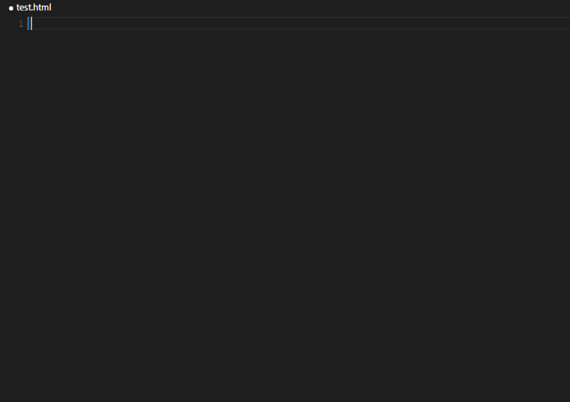

# Angular Material Snippets

A set of [Angular Material](https://material.angularjs.org/latest) Snippets for [Visual Studio Code](https://code.visualstudio.com/). 

*Shift + Alt + f =  formats the code*

## Shortcuts

**Extension is still in progress.**

*Below are the currently added shortcuts*

| Autocomplete | |
|---|---|
| **Shortcut Prefix** | **Description** |
|`md-autocomplete:full` | all autocomplete options|
|`md-autocomplete:tpl` | all autocomplete options with custom template|

| Button | |
|---|---|
|**Shortcut Prefix** | **Description** |
|`md-button:standard` | standard button no options|
|`md-button:full` | standard button with all options|
|`md-button:icon` | standard button with icon|
|`md-button:fab-icon` | fab icon button|
|`md-button:fab-mini-icon` | mini fab icon button|

| Card | |
|---|---|
|**Shortcut Prefix** | **Description** |
|`md-card:standard` | standard card|

| Checkbox | |
|---|---|
|**Shortcut Prefix** | **Description** |
|`md-checkbox:full` | checkbox full options|

| Chip | |
|---|---|
|**Shortcut Prefix** | **Description** |
|`md-chip:single` |  single md-chip item|

| Layout | |
|---|---|
|**Shortcut Prefix** | **Description** |
|`md-layout` |  the md-content tag with layout options|

| Datepicker | |
|---|---|
|**Shortcut Prefix** | **Description** |
|`md-dialog:standard` |  date picker with full options|

| Dialog | |
|---|---|
|**Shortcut Prefix** | **Description** |
|`md-datepicker:full` |  standard dialog|

| Divider | |
|---|---|
|**Shortcut Prefix** | **Description** |
|`md-divider` |  simple divider|

| Ink Ripple | |
|---|---|
|**Shortcut Prefix** | **Description** |
|`md-ink-ripple` | md-ink-ripple options|

| Whiteframe | |
|---|---|
|**Shortcut Prefix** | **Description** |
|`md-whiteframe` | md-whiteframe options|

| Swipe | |
|---|---|
|**Shortcut Prefix** | **Description** |
|`md-swipe` | swipe options|

## Json lint Test
Lint testing using [gulp-jsonlint](https://www.npmjs.com/package/gulp-jsonlint).

## RoadMap
Depends heavily of the migration of angular material to angular2.

## License

[MIT License] 

[![License][license-badge]][MIT License]

[MIT License]: http://en.wikipedia.org/wiki/MIT_License
[license-badge]: https://img.shields.io/badge/license-MIT-blue.svg
